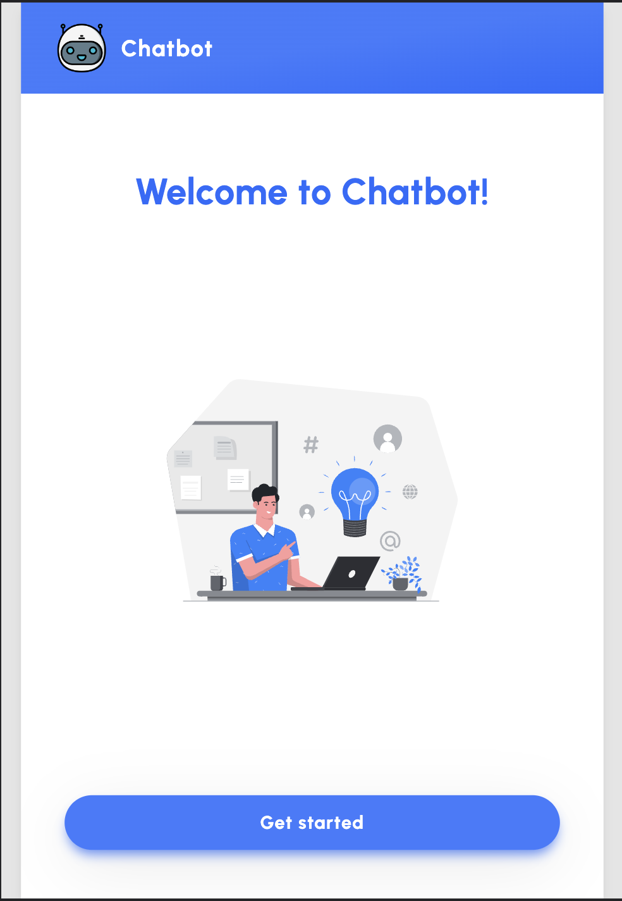
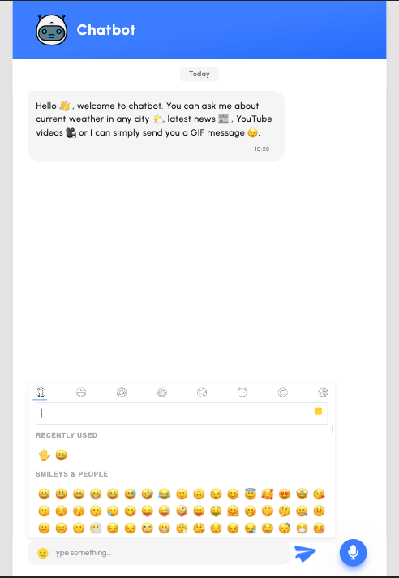
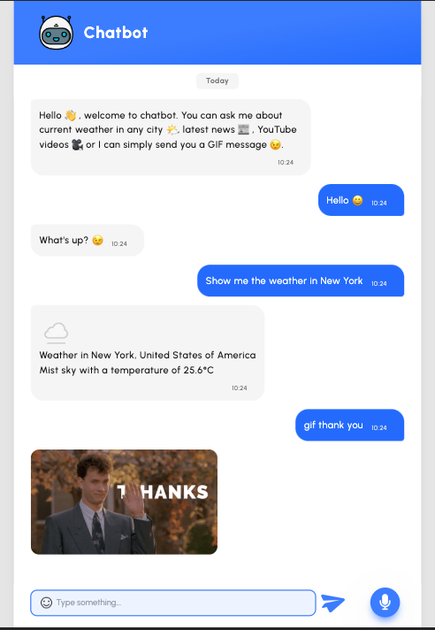

# ChatbotProject
Chatbot project

<div align="center">

  
  <h1>Chatbot app</h1>
  
  <p>
    Ask chatbot about current weather in any city 🌤, latest news 📰 , YouTube videos 🎥 or a GIF message 😉. You can send a message to chatbot by using text input field or you can use a microphone button and leave a message using your voice 🎙.
  </p>
  

<br />

<!-- Table of Contents -->
# :notebook_with_decorative_cover: Table of Contents

- [About the Project](#star2-about-the-project)
  * [Screenshots](#camera-screenshots)
  * [Tech Stack](#space_invader-tech-stack)
  * [Features](#dart-features)
  * [Color Reference](#art-color-reference)
  * [Environment Variables](#key-environment-variables)
- [Getting Started](#toolbox-getting-started)
  * [Prerequisites](#bangbang-prerequisites)
  * [Installation](#gear-installation)
  * [Running Tests](#test_tube-running-tests)
  * [Run Locally](#running-run-locally)
  * [Deployment](#triangular_flag_on_post-deployment)
- [Usage](#eyes-usage)
- [Roadmap](#compass-roadmap)
- [Contributing](#wave-contributing)
- [License](#warning-license)
- [Contact](#handshake-contact)
- [Acknowledgements](#gem-acknowledgements)

  

<!-- About the Project -->
## :star2: About the Project


<!-- Screenshots -->
### :camera: Screenshots

<div align="center"> 
  
  
  
  
</div>


<!-- TechStack -->
### :space_invader: Tech Stack

<details>
  <summary>Client</summary>
  <ul>
    <li><a href="https://reactjs.org/">React.js</a></li>
    <li><a href="https://tailwindcss.com/">TailwindCSS</a></li>
  </ul>
</details>

<details>
  <summary>Server/API</summary>
  <ul>
    <li><a href="https://developer.mozilla.org/en-US/docs/Web/API/Web_Speech_API">Web Speech API</a></li>
    <li><a href="https://wit.ai/">wit.ai/</a></li>
    <li><a href="https://newsapi.org/">newsapi.org</a></li>
    <li><a href="https://www.weatherapi.com/">weatherapi.com/</a></li>
    <li><a href="https://developers.giphy.com/">developers.giphy.com/</a></li>
  </ul>
</details>


<!-- Features -->
### :dart: Features
- Text input field 📬 
- Voice message 🎙
- Current weather 🌤 in any city
- Random latest news 📰 
- GIF message 🧸
- YouTube video 📹
- Emoji picker ✨


<!-- Color Reference -->
### :art: Color Reference

| Color             | Hex                                                                |
| ----------------- | ------------------------------------------------------------------ |
| Primary Color |  #246BFD |
| Secondary Color |  #3C7CFE |
| Accent Color |  #F5F5F5 |


<!-- Env Variables -->
### :key: Environment Variables

To run this project, you will need to add the following environment variables to your .env file

`VITE_WIT_API_KEY=`

`VITE_WEATHER_API_KEY=`

`VITE_GIPHY_API_KEY=`

`VITE_NEWS_API_KEY=`

`VITE_YOUTUBE_API_KEY=`

<!-- Getting Started -->
## 	:toolbox: Getting Started

<!-- Prerequisites -->
### :bangbang: Prerequisites

This project uses npm as package manager

```bash
npm install
```

<!-- Installation -->
### :gear: Installation

Install chatbot with npm

```bash
  npm install chatbot
  cd chatbot
```
   
<!-- Running Tests -->
### :test_tube: Running Tests

To run tests, run the following command

```bash
  yarn test test
```

<!-- Run Locally -->
### :running: Run Locally

Clone the project

```bash
  git clone https://github.com/MartynaMorawiec/ChatbotProject.git
```

Go to the project directory

```bash
  cd chatbot
```

Install dependencies

```bash
  npm install
```

Start the server

```bash
  npm run dev
```


<!-- Usage -->
## :eyes: Usage

User can:
- send a message to chatbot by using a text input field 📬 
- use a microphone button and leave a message using voice 🎙
- ask about the current weather 🌤 in any city by providing any question with the key word weather
- get random latest news by providing any question with the key word news 📰 
- ask about a GIF using gif/GIF/meme/giphy as a first word and then specifying name of a GIF 🧸
- get a random YouTube video writing youtube/video as a first word and then specifying title of the video 📹
- greet the chatbot 😊
- say goodbye to chatbot 👋 


<!-- Contributing -->
## :wave: Contributing

<a href="https://github.com/Louis3797/awesome-readme-template/graphs/contributors">
  
</a>


Contributions are always welcome!


<!-- License -->
## :warning: License

Distributed under the no License. 


<!-- Contact -->
## :handshake: Contact

Martyna Morawiec - martyna.jasinska1@gmail.com

Project Link: 


<!-- Acknowledgments -->
## :gem: Acknowledgements

 - [Emoji picker](https://www.npmjs.com/package/emoji-picker-react)
 - [Tailwind](https://tailwindcss.com/)
 - [Speech recognition](https://www.npmjs.com/package/react-speech-recognition)
 - [wit.ai](https://wit.ai/)
 - [News API](https://newsapi.org/)
 - [Weather API](https://www.weatherapi.com/)
 - [GIPHY developers](https://developers.giphy.com/)
 - [Vite](https://vitejs.dev/)

 
