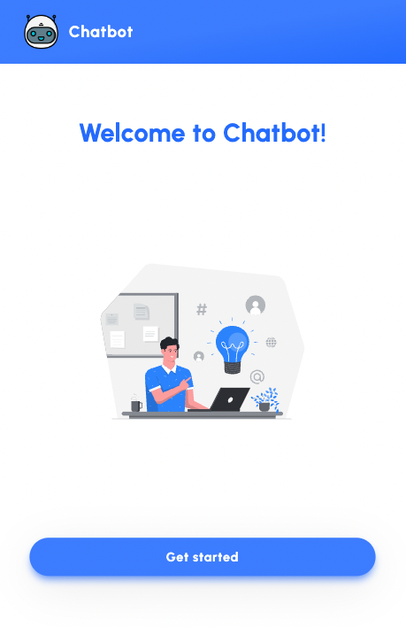
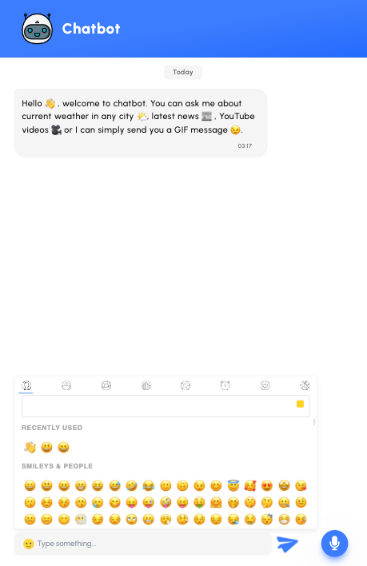
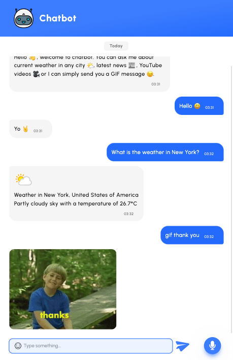

# ChatbotProject

<div align="center">
  
  <h1>Chatbot app</h1>
  
  <p>
      Ask chatbot about current weather in any city 🌤, latest news 📰 , YouTube videos 🎥 or a GIF message 😉. You can send a message to chatbot by using text input field or you can use a microphone button and leave a message using your voice 🎙.
  </p> 
</div>

<br />

<!-- Table of Contents -->

# :notebook_with_decorative_cover: Table of Contents

- [About the Project](#star2-about-the-project)
  - [Screenshots](#camera-screenshots)
  - [Tech Stack](#space_invader-tech-stack)
  - [Features](#dart-features)
  - [Color Reference](#art-color-reference)
  - [Wit.ai configuration](#technologist-wit-configuration)
  - [Environment Variables](#key-environment-variables)
- [Getting Started](#toolbox-getting-started)
  - [Prerequisites](#bangbang-prerequisites)
  - [Running Tests](#test_tube-running-tests)
  - [Run Locally](#running-run-locally)
- [Usage](#eyes-usage)
- [Contributing](#wave-contributing)
- [License](#warning-license)
- [Contact](#handshake-contact)
- [Acknowledgements](#gem-acknowledgements)

<!-- About the Project -->

## :star2: About the Project

<!-- Screenshots -->

### :camera: Screenshots

<div align="center"> 
  
  
  
  
</div>

<!-- TechStack -->

### :space_invader: Tech Stack

<details>
  <summary>Client</summary>
  <ul>
    <li><a href="https://reactjs.org/">React.js</a></li>
    <li><a href="https://tailwindcss.com/">TailwindCSS</a></li>
  </ul>
</details>

<details>
  <summary>Server/API</summary>
  <ul>
    <li><a href="https://developer.mozilla.org/en-US/docs/Web/API/Web_Speech_API">Web Speech API</a></li>
    <li><a href="https://wit.ai/">Wit.ai</a></li>
    <li><a href="https://newsdata.io/">News API</a></li>
    <li><a href="https://www.weatherapi.com/">Weather API</a></li>
    <li><a href="https://developers.giphy.com/">GIPHY</a></li>
  </ul>
</details>

<details>
  <summary>Testing</summary>
  <ul>
    <li><a href="https://www.cypress.io/">Cypress.io</a></li>
  </ul>
</details>

<!-- Features -->

### :dart: Features

- Text input field 📬
- Voice message 🎙 (For the smoothest experience use Chrome desktop browser. [Check supported browsers](https://www.npmjs.com/package/react-speech-recognition#supported-browsers))
- Current weather 🌤 in any city
- Random latest news 📰
- GIF message 🧸
- YouTube video 📹
- Emoji picker ✨

<!-- Color Reference -->

### :art: Color Reference

| Color           | Hex                                                                                     |
| --------------- | --------------------------------------------------------------------------------------- |
| Primary Color   |  #246BFD   |
| Secondary Color |  #3C7CFE |
| Accent Color    |  #F5F5F5    |

<!-- Wit.ai configuration -->

### :technologist: Wit Configuration

To run this project, you will need to create [Wit app](https://wit.ai/).

You should add the following:

| Intents         | Entities     | Traits        |
| --------------- | ------------ | ------------- |
| get_news        | news         |               |
| wit/get_weather | wit/location |               |
| greeting        |              | wit/greetings |
| bye             |              | wit/bye       |

Create intents and appropriate utterances that describe some ways someone can ask about the:

- News: highlight the key word "news" and create the corresponding entity
- Weather: highlight the location part of the sentence and create the corresponding entity
- Greetings
- Bye

<!-- Env Variables -->

### :key: Environment Variables

To run this project, you will need to add the following environment variables to your .env file

`VITE_WIT_API_KEY=`

`VITE_WEATHER_API_KEY=`

`VITE_GIPHY_API_KEY=`

`VITE_NEWS_API_KEY=`

`VITE_YOUTUBE_API_KEY=`

<!-- Getting Started -->

## :toolbox: Getting Started

<!-- Prerequisites -->

### :bangbang: Prerequisites

This project uses npm as package manager

```bash
  npm install
```

<!-- Running Tests -->

### :test_tube: Running Tests

To run tests, run the following command

```bash
  npm run cypress:open
```

<!-- Run Locally -->

### :running: Run Locally

Clone the project

```bash
  git clone https://github.com/MartynaMorawiec/ChatbotProject.git
```

Go to the project directory

```bash
  cd ChatbotProject
```

Install dependencies

```bash
  npm install
```

Start the server

```bash
  npm run dev
```

<!-- Usage -->

## :eyes: Usage

User can:

- send a message to chatbot by using a text input field 📬
- use a microphone button and leave a message using voice 🎙 (For the smoothest experience use Chrome desktop browser. [Check supported browsers](https://www.npmjs.com/package/react-speech-recognition#supported-browsers))
- ask about the current weather 🌤 in any city by providing any question with the key word weather
- get random latest news by providing any question with the key word news 📰
- ask about a GIF using gif/GIF/meme/giphy as a first word and then specifying name of a GIF 🧸
- get a random YouTube video writing youtube/video as a first word and then specifying title of the video 📹
- greet the chatbot 😊
- say goodbye to chatbot 👋

<!-- Contributing -->

## :wave: Contributing

<a href="https://github.com/Louis3797/awesome-readme-template/graphs/contributors">
  
</a>

Contributions are always welcome!

<!-- License -->

## :warning: License

Distributed under the MIT License.

<!-- Contact -->

## :handshake: Contact

Martyna Morawiec - martyna.jasinska1@gmail.com

Project Link: https://hello-chatbot.netlify.app/

<!-- Acknowledgments -->

## :gem: Acknowledgements

- [Emoji picker](https://www.npmjs.com/package/emoji-picker-react)
- [Tailwind](https://tailwindcss.com/)
- [Speech recognition](https://www.npmjs.com/package/react-speech-recognition)
- [Wit.ai](https://wit.ai/)
- [News API](https://newsdata.io/)
- [Weather API](https://www.weatherapi.com/)
- [GIPHY](https://developers.giphy.com/)
- [Vite](https://vitejs.dev/)
- [Animate.css](https://animate.style/)
- [Cypress.io](https://www.cypress.io/)
